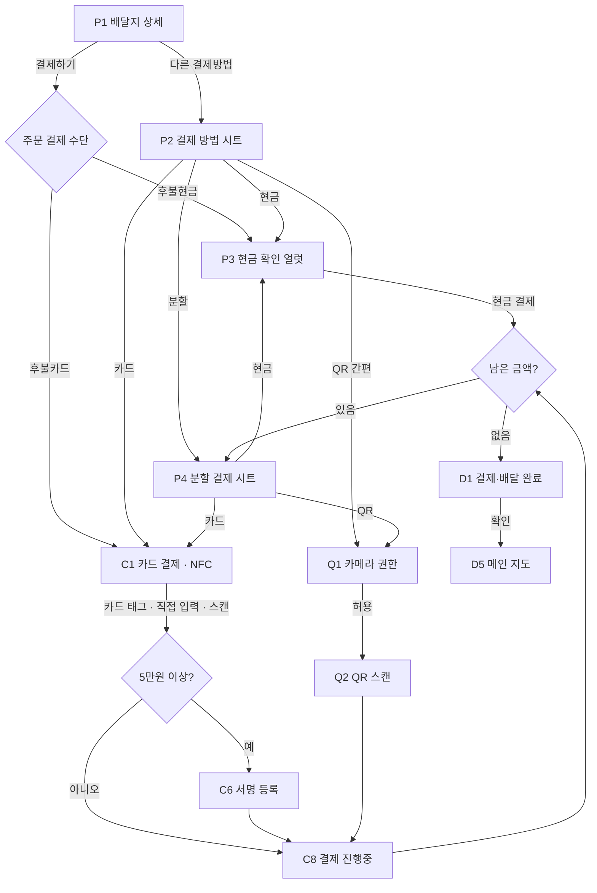
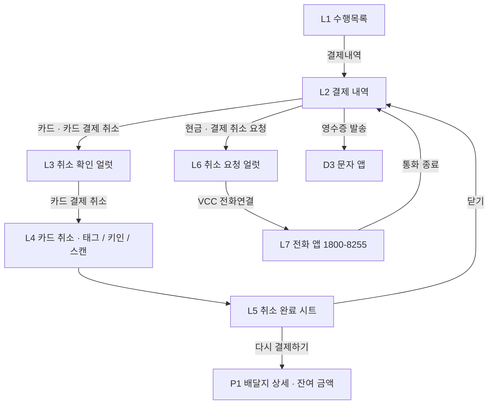

# 후불결제 스토리보드 — 부릉 프렌즈 기사앱

기사가 배달지에서 고객에게 상품 대금을 받는 흐름입니다. 구현된 프로토타입을 그대로 정리한
문서라, 여기 적힌 동작은 전부 눌러서 확인할 수 있습니다.

| | |
| --- | --- |
| 작성 | 2026-07-29 · 이재이 |
| 기준 | 프로토타입 `a93a905` · Figma [후불결제](https://www.figma.com/design/u3qTdSzPaWpS6P6AlGdR8w/) |
| 프로토타입 | https://jaei-lee.github.io/vroong-postpaid-prototype/ |
| 대응 코드 | [README](README.md)의 "Figma 노드 ↔ 코드 대응" 표 |

## 0. 문서 규칙

- **화면 ID** — `P` 결제 시작 / `C` 카드 / `Q` QR / `D` 완료·영수증 / `L` 수행목록·취소.
  프로토타입 주소 뒤에 `#/delivery`처럼 라우트를 붙이면 해당 화면으로 바로 들어갑니다.
- **시트·얼럿도 화면으로 셉니다** — 기사가 그 위에서 판단하고 되돌아갈 수 있는 단위라서입니다.
- **음영 처리한 화면**(C5 · D3 · L7)은 부릉플러스가 아니라 단말의 다른 앱입니다.

### 기준 데이터

| 항목 | 값 | 비고 |
| --- | --- | --- |
| 주문 결제 수단 | 후불현금 | 주문 속성. 기사가 실제로 받는 방법과 별개입니다 (§4.1) |
| 결제필요금액 | 58,500원 | 상품가액 57,600원 + 컵 보증금 900원 |
| 배송료 | 5,000원 | 완료 화면에만 나옵니다 |
| 고객 안심번호 | 050-7124-8836 | 영수증 문자 수신번호 |
| 서명 기준 | 5만원 이상 | 카드 결제에만 적용 (§4.3) |
| 할부 | 일시불 / 2~12개월 | 카드 결제 |

## 1. 전체 플로우

### 1.1 결제 받기

### 1.2 결제 취소

## 2. 화면 목록

| ID | 화면 | 라우트 | Figma |
| --- | --- | --- | --- |
| P1 | 배달지 상세 (픽업후) | `#/delivery` | `1723:158379` · `1730:197496` |
| P2 | 결제 방법 시트 | 시트 | `1723:157638` · `1723:158481` · `1737:24157` |
| P3 | 현금 결제 확인 얼럿 | 얼럿 | `1723:156090` · `1730:195338` |
| P4 | 분할 결제 시트 | 시트 | `1730:197705` · `195938` · `195946` · `195840` · `196227` |
| C1 | 카드 결제 · NFC | `#/card` | `1723:157653` · `157654` · `1730:197704` |
| C2 | 카드 직접 입력 | `#/card/keyin` | `1723:157655` · `157657` |
| C3 | 카드 스캔 | `#/card/scan` | `1742:54122` · `54182` |
| C4 | 카드 정보 확인 시트 | 시트 | `1742:54183` |
| C5 | KIS Pay | `#/kispay` | `1772:130317` |
| C6 | 서명 등록 | `#/sign` | `1730:197571` · `197573` |
| C7 | 할부 선택 시트 | 시트 | `1730:197143` |
| C8 | 결제 진행중 | 오버레이 | `1723:157658` · `1730:197562` |
| Q1 | 카메라 권한 팝업 | 얼럿 | `1747:121729` |
| Q2 | QR 간편 결제 · 스캔 | `#/qr` | `1730:197575` |
| D1 | 결제·배달 완료 | `#/complete` | `1723:157236` · `157270` · `1730:197353` · `197859` |
| D2 | 영수증 발송 시트 | 시트 | `1730:198565` |
| D3 | 문자 앱 | `#/sms` | 디자인 없음 |
| D4 | 현금영수증 발급번호 입력 | 시트 | `1723:157212` · `157237` · `1730:198018` |
| D5 | 메인 지도 | `#/main` | — |
| L1 | 수행목록 | `#/tasks` | `1730:196848` · `196061` |
| L2 | 결제 내역 | `#/tasks/payment` | `1730:196892` · `196850` · `198254` · `197002` · `197003` |
| L3 | 카드 결제 취소 확인 얼럿 | 얼럿 | `1730:197134` |
| L4 | 카드 결제 취소 | `#/card/cancel` | `1730:197613` |
| L5 | 결제 취소 완료 시트 | 시트 | `1730:197695` · `197701` |
| L6 | 현금 결제 취소 요청 얼럿 | 얼럿 | `1730:196990` · `196997` |
| L7 | 전화 앱 (VCC) | 오버레이 | `1773:130318` |

## 3. 화면별 상세

### P1 · 배달지 상세 (픽업후)

`#/delivery` — 프로토타입 시작 화면. 결제 화면에서 나오거나 취소 후 `다시 결제하기`로도 돌아옵니다.

**구성** 지도 + `수행목록` FAB / 배달지 주소·배송메시지·상품픽업번호·부릉오더번호 시트 /
`결제필요금액 58,500원` + `후불현금` 배지 / 하단 결제 바

**동작**

| 요소 | 결과 |
| --- | --- |
| `수행목록` FAB | L1 수행목록 |
| `현금 결제` 줄 | 표시 전용. **주문의 결제 수단**이라 바뀌지 않습니다 (§4.1) |
| `다른 결제방법 >` | P2 결제 방법 시트 |
| `58,500원 결제하기` | 주문 결제 수단으로 시작 → 후불현금이므로 P3 |

**잔여 금액이 있을 때** (분할로 일부만 받았거나 취소한 경우)

- 하단 바에서 결제 방법 줄과 `다른 결제방법`이 사라지고 `⚠ 잔여 결제 금액 있음` 한 줄만 남습니다.
- CTA 금액이 남은 금액으로 바뀝니다 — `28,200원 결제하기`.
- 누르면 P2가 뜨고, **고른 방법으로 남은 금액만** 받습니다. 분할 결제 중이면 P4가 바로 열립니다.

### P2 · 결제 방법 시트

**구성** `어떻게 결제하시겠어요?` / `총 결제 금액 58,500원` + 주문 결제 수단 배지 /
`현금` `카드` (전체 폭) · `QR 간편` `분할` (반 폭)

**동작** 방법을 고르면 시트가 닫히고 바로 그 결제로 들어갑니다 — 현금 → P3, 카드 → C1,
QR 간편 → Q1, 분할 → P4.

**예외** X 또는 딤 영역을 누르면 아무것도 하지 않고 닫힙니다. 이때 고른 방법은 되돌아갑니다 (§4.1).

### P3 · 현금 결제 확인 얼럿

**구성** `현금으로 결제하시겠어요?` / `고객에게 받은 현금만큼 기사님의 M캐시에서 차감됩니다` /
우측 상단 X · `다른 결제방법` · `현금 결제`

**동작**

| 요소 | 결과 |
| --- | --- |
| `현금 결제` | 결제 기록 후 D1 (남은 금액이 있으면 P4) |
| `다른 결제방법` | P2 |
| X | 닫기 |

**분기** 분할 결제의 한 회차로 띄운 경우에는 X와 `다른 결제방법` 모두 P4로 돌아가고,
**입력했던 금액이 유지됩니다.**

### P4 · 분할 결제 시트

한 주문을 여러 번에 나눠 받습니다. 상품가액과 컵 보증금을 따로 정합니다.

**구성** `총 결제 금액 58,500원` / `잔여 상품가액` `잔여 컵 보증금` / 상품가액 입력 필드 /
컵 보증금 `−` `+` (300원 단위) / `QR` `현금` `카드`

**동작**

| 요소 | 결과 |
| --- | --- |
| 상품가액 필드 | 숫자 키패드가 올라오고 시트가 그만큼 위로 올라갑니다 |
| `−` `+` | 컵 보증금을 300원씩. `+`는 잔여 컵 보증금까지만 |
| `QR` `현금` `카드` | 금액이 0원보다 커야 활성. 현금 → P3, 카드 → C1, QR → Q1 |
| X | 닫기 (방법을 다시 묻지 않습니다) |

**입력 오류** 잔여 상품가액보다 크게 넣으면 필드가 빨간 테두리 + `잔여 상품가액 보다 작게 입력하세요`,
결제 버튼은 비활성입니다.

**회차를 받은 뒤**

- 남았으면 **시트가 다시 열립니다** + 토스트 `현금 30,300원이 결제되었어요 / 전체 결제 후 영수증 발송이 가능해요`.
  카드·QR 회차는 그 화면을 다녀와 P1에서 다시 열립니다.
- 상품가액을 다 받으면 금액 필드가 비활성되고 컵 보증금만 남습니다 (`1730:196227`).
- 전부 받으면 D1.

### C1 · 카드 결제 · NFC

`#/card` — 카드 결제의 기본 화면입니다.

**구성** 앱바 `카드 결제` + `카드 리더기로 결제` / `총 결제 금액` (분할 회차면 그 회차 금액) /
NFC 일러스트 / `카드를 휴대폰 뒷면에 대주세요` / `후불교통카드, 삼성페이, 애플페이 등 가능` /
`카드 직접 입력`

**동작**

| 요소 | 결과 |
| --- | --- |
| 카드 태그 (일러스트 탭) | 5만원 이상이면 C6, 아니면 C8 → 결제 완료 |
| `카드 리더기로 결제` | C5 KIS Pay |
| `카드 직접 입력` | C2 |
| 뒤로가기 `<` | P1로 복귀. 방법을 다시 묻지 않고, 고른 방법은 되돌립니다 |

**참고** 2.5초 뒤 `카드번호를 직접 입력할 수도 있어요` 툴팁이 뜹니다. 안드로이드 크롬에서는
실제 NFC 태그를 읽고, 그 밖의 환경에서는 일러스트를 눌러 대신합니다.

### C2 · 카드 직접 입력

`#/card/keyin`

**구성** 카드번호 필드 · 유효기간 필드 / 보안키패드 (숫자 배열이 매번 섞입니다) / `카드 스캔하기`

**동작**

| 단계 | 결과 |
| --- | --- |
| 카드번호 16자리 | 뒤 8자리는 `•`로 가려지고, 다 채우면 유효기간으로 자동 이동 |
| 유효기간 4자리 | 전부 가려집니다. 다 채우면 키패드가 내려가고 `결제하기` 활성 |
| `결제하기` | 5만원 이상이면 C6, 아니면 C8 |
| `카드 스캔하기` | Q1 카메라 권한 → C3 |

### C3 · 카드 스캔 · C4 · 카드 정보 확인

`#/card/scan`

**구성** 카메라 미리보기 + 스캔 네모 / `카드를 네모 안에 맞춰주세요`

**동작** 인식되면 네모가 파란색으로 바뀌고 `결제 진행중`을 거쳐 C4 시트가 뜹니다.
C4는 읽어낸 `4788 - 9200 - 1328 - 5829` / `09 / 28`을 보여주고 세 갈래입니다 —
`다시 스캔하기`(C3 처음), `카드 직접 입력`(C2), `결제하기`(C8).

**예외** 카메라를 못 쓰는 환경에서는 디자인의 캡처 이미지로 대체되고, 흐름은 같습니다.

### C5 · KIS Pay

`#/kispay` — 카드 리더기(단말기)로 결제하는 외부 앱입니다.

**동작** 화면 안내대로 뒤로가기를 누르면 C1로 돌아옵니다. 프로토타입에서는 실제 승인이
일어나지 않으므로 `테스트를 위해 뒤로가기를 다시 눌러주세요`를 함께 띄웁니다.

### C6 · 서명 등록 · C7 · 할부 선택

`#/sign` — **카드 결제 금액이 5만원 이상일 때** C8 앞에 끼어듭니다.

**구성** 고객 안내 띠배너 (`5만원 이상 결제할 때 서명을 등록해야 해요`) / `할부 ▾` /
서명란 / `다시 하기` / `등록하기`

**동작**

| 요소 | 결과 |
| --- | --- |
| `할부 ▾` | C7 시트 — 일시불 / 2~12개월 → `선택 완료` |
| 서명란 | 손가락·마우스로 그립니다 |
| `다시 하기` | 서명 지우기 |
| `등록하기` | C8 → 결제 완료 |

**참고** 결제할 때마다 새로 받습니다 — 한 번 받은 서명을 재사용하지 않습니다.

### C8 · 결제 진행중

모든 결제 방법이 공통으로 거치는 오버레이입니다. 1.5초 뒤 결과로 넘어갑니다 —
남은 금액이 있으면 P1(+토스트)이나 P4, 없으면 D1.

### Q1 · 카메라 권한 · Q2 · QR 간편 결제

`#/qr`

**Q1** OS 권한 팝업입니다. `앱 사용 중에만 허용`을 고르면 다음부터 다시 묻지 않고,
`이번만 허용`은 기억하지 않습니다. `허용 안함`이면 P1으로 돌아가고
`카메라 권한을 허용해야 QR 간편 결제를 할 수 있어요` 스낵바가 뜹니다.

**Q2** `총 결제 금액` + 스캔 네모(스캔 라인이 위아래로 움직입니다) +
`QR·바코드를 네모 안에 보여주세요`. 인식되면 C8 → D1.
앱바 뒤로가기와 `✕` 모두 P1으로 나오고, 고른 방법은 되돌립니다.

### D1 · 결제·배달 완료

`#/complete`

**구성** `결제·배달 완료` / 결제 금액 + 배송료 5,000원 / `영수증 발송` · `현금영수증 발급` /
진행한 미션 11개 / `확인`

**결제 방법별 차이**

| 결제 방법 | 금액 라벨 | 버튼 |
| --- | --- | --- |
| 현금 | `현금 결제 금액 (M캐시 차감)` | 영수증 발송 · 현금영수증 발급 |
| 카드 | `카드 결제 금액` | 영수증 발송 (전체 폭) |
| QR | `QR 결제 금액` | 영수증 발송 (전체 폭) |
| 분할 | `총 결제 금액` + 건별 내역 | 현금이 섞였으면 현금영수증 발급도 |

**동작**

| 요소 | 결과 |
| --- | --- |
| `영수증 발송` | 한 건이면 D3 문자 앱, 분할이면 D2 시트 |
| `현금영수증 발급` | D4. 발급하면 버튼이 비활성되고 `영수증 확인` 줄이 붙습니다 |
| `확인` | D5 메인 지도 |

**알림** 현금이 섞여 있으면 진입 시 `배송수수료 입금 / M캐시 잔액이 변경되었습니다` 헤드업
알림이 4.5초간 뜹니다. 문자 앱에 다녀와 다시 들어올 때는 뜨지 않습니다.

### D2 · 영수증 발송 시트

분할 결제는 `전체 결제 내역`과 건별(`30,300원 현금 결제` 등) 영수증을 각각 보낼 수 있습니다.
`발송`을 누르면 D3으로 넘어갑니다.

### D3 · 문자 앱

`#/sms` — 단말의 문자 앱입니다. 수신번호는 고객 안심번호이고 영수증 이미지가 첨부되어 있습니다.
`전송`을 누르면 원래 화면(D1 또는 L2)으로 돌아오고 `영수증을 발송했어요` 스낵바가 뜹니다.

### D4 · 현금영수증 발급번호 입력

**구성** `개인 소득공제용` / `사업자 지출증빙` 라디오 + 번호 입력 필드 + 숫자 키패드

**동작** 유형에 따라 플레이스홀더가 바뀝니다 — 개인은 `휴대폰번호 또는 사업자등록번호`,
사업자는 `사업자등록번호`. 번호를 넣으면 `확인`이 활성되고, 발급하면 가운데 정렬 토스트로
알려줍니다.

### D5 · 메인 지도

`#/main` — 배차를 기다리는 홈 화면입니다. `신규배차 ON`, 하단 `수행목록`으로 L1에 들어갈 수 있습니다.

### L1 · 수행목록

`#/tasks` — P1의 `수행목록` FAB로 들어옵니다.

**구성** 픽업·배달 지점 목록 (지금 수행 중인 배달만 펼쳐짐) / `결제필요금액` 또는
`58,500원 결제완료` + `후불현금` 배지 / `고객 전화` `문자 전송` / `결제내역`

**동작**

| 요소 | 결과 |
| --- | --- |
| `결제내역` | L2 |
| `결제하기` (잔여 있을 때) | P1과 같은 판단 — 분할 중이면 P4, 아니면 P2 |
| 뒤로가기 `<` | 들어온 지도 화면 (결제 전 P1 / 결제 후 D5) |

**잔여 금액이 있을 때** 노란 안내 박스에 `⚠ 잔여 결제 금액: 28,200원`과 함께
`결제내역` `결제하기`가 나란히 놓입니다.

### L2 · 결제 내역

`#/tasks/payment`

**구성** 상단 요약(`총 결제 금액` / `잔여 결제 금액`) + 결제 건별 카드

| 결제 건 | 내용 | 버튼 |
| --- | --- | --- |
| 카드 | 카드사·카드번호·승인번호·할부·결제일시 | `카드 결제 취소` `영수증 발송` |
| 현금 | 금액·결제일시 (+ 발급했으면 `영수증 확인`) | `결제 취소 요청` `현금영수증 발급` |
| 취소된 건 | 금액에 취소선 + 취소일시 | 없음 |

**동작** `카드 결제 취소` → L3, `결제 취소 요청` → L6, `영수증 발송` → D3,
`현금영수증 발급` → D4.

### L3 · 카드 결제 취소 확인 · L4 · 카드 결제 취소

**L3** `카드 결제를 취소하시겠어요?` — `취소` / `카드 결제 취소`.

**L4** `#/card/cancel` — 결제했던 카드를 다시 받는 화면입니다. `취소할 금액`이 빨간색으로 나옵니다.
카드 태그 · `카드 직접 입력` · `카드 스캔하기` 세 방법 모두 취소할 수 있고, `취소 진행중`을 거쳐
L5로 넘어갑니다.

### L5 · 결제 취소 완료 시트

**구성** `결제 취소 완료` + 취소 금액 + `영수증 발송` / `닫기` `다시 결제하기`

**동작** `닫기` → L2 (해당 건에 취소선 + 취소일시), `다시 결제하기` → P1 (잔여 결제 금액 상태).

### L6 · 현금 결제 취소 요청 · L7 · 전화 앱

현금은 **기사가 직접 취소할 수 없습니다.** VCC(상담)에 전화로 요청합니다.

**L6** `현금 결제 취소는 VCC를 통해 처리됩니다` + `VCC 전화연결`.
현금영수증을 발급했으면 `발급 내역도 함께 취소됩니다` 문단이 하나 더 붙습니다.

**L7** 전화 앱(1800-8255)입니다. 화면 아무 곳이나 누르면 통화가 끝난 것으로 보고 L2로 돌아오며,
해당 건에 취소선이 그려지고 `현금 결제 취소가 완료되었어요` 토스트가 뜹니다.

## 4. 정책

### 4.1 주문의 결제 수단 vs 이번에 받을 방법

둘은 다른 값입니다.

| | 값 | 어디에 보이나 | 언제 바뀌나 |
| --- | --- | --- | --- |
| 주문의 결제 수단 | 후불현금 / 후불카드 | P1 하단 바, P1·L1 배지, P2 배지 | 바뀌지 않습니다 |
| 이번에 받을 방법 | 현금 / 카드 / QR / 분할 | P2에서 고른 값 | 결제 한 번에만 적용 |

- `결제하기`는 **항상 주문의 결제 수단**으로 시작합니다. 지난번에 QR을 골랐어도 후불현금
  주문이면 현금 확인 얼럿이 뜹니다.
- 결제하지 않고 나오면(카드 뒤로가기 · QR 닫기 · 분할 시트 X · 얼럿 X) 고른 방법은 되돌아갑니다.

### 4.2 잔여 금액

- 분할로 일부만 받았거나, 받은 결제를 취소하면 잔여 금액이 생깁니다.
- 잔여가 있으면 **그 금액만** 받습니다 — 전액을 다시 받아 과결제가 되지 않습니다.
- 잔여가 있는 동안 P1 하단 바에서는 결제 방법을 바꿀 수 없습니다 (`⚠ 잔여 결제 금액 있음`).
- 전부 받으면 D1으로 넘어갑니다.

### 4.3 서명

- **카드 결제 금액 5만원 이상**일 때만 C6이 끼어듭니다. 분할 회차라면 그 회차 금액 기준입니다.
- 결제할 때마다 새로 받습니다.
- 현금·QR은 서명이 없습니다.

### 4.4 취소

| 결제 방법 | 취소 방법 | 결과 |
| --- | --- | --- |
| 카드 | 기사가 결제했던 카드를 다시 받아 취소 (L4) | 즉시 취소, 잔여 금액 생김 |
| 현금 | VCC 전화로 요청 (L6 · L7) | 통화 후 취소, 현금영수증도 함께 취소 |
| QR | 프로토타입에 없음 — **정책 확인 필요** | — |

취소된 건은 목록에서 사라지지 않고 금액에 취소선 + 취소일시가 남습니다.

### 4.5 영수증

- **영수증 발송**은 고객 안심번호로 문자를 보냅니다. 분할 결제는 전체 내역과 건별로 나눠 보냅니다.
- 분할 결제 중에는 발송할 수 없습니다 (`전체 결제 후 영수증 발송이 가능해요`).
- **현금영수증**은 현금으로 받은 금액에만 발급할 수 있고, 한 번 발급하면 버튼이 비활성됩니다.

## 5. 확인이 필요한 항목

| # | 내용 | 근거 |
| --- | --- | --- |
| 1 | 컵 보증금 스테퍼 단위 300원 | 디자인 값(300 / 900)에서 유추 |
| 2 | QR 결제의 취소 흐름 | 디자인 없음 |
| 3 | NFC 태그를 못 읽는 단말에서의 대체 흐름 | 프로토타입은 탭으로 대체 |
| 4 | 카드 취소 시 원거래와 다른 카드를 댔을 때 | 프로토타입은 검증하지 않습니다 |
| 5 | 분할 결제 회차 수 상한 | 제한 없음으로 구현 |
| 6 | 서명 미등록 상태로 5만원 이상 결제 시도 | 프로토타입은 등록해야 진행 |

디자인과 다르게 구현한 부분은 [README](README.md)의 "디자인과 다르게 구현한 부분"에
50개 항목으로 정리해 두었습니다.
